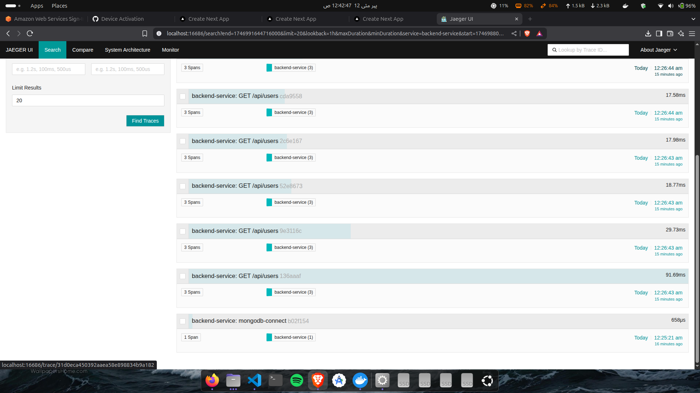
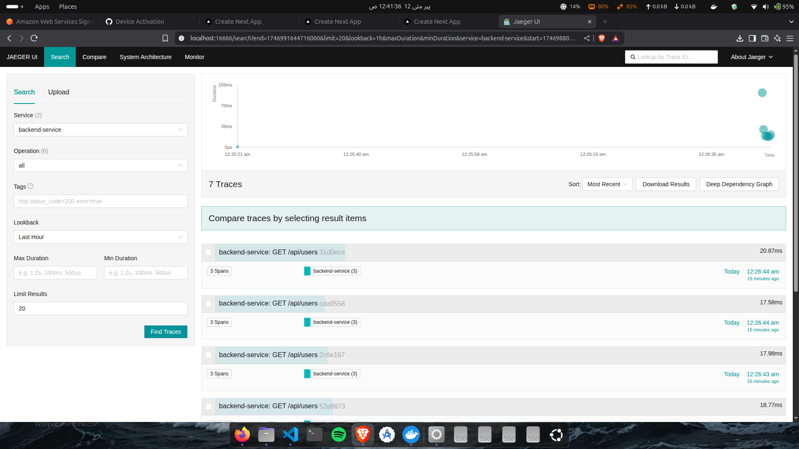
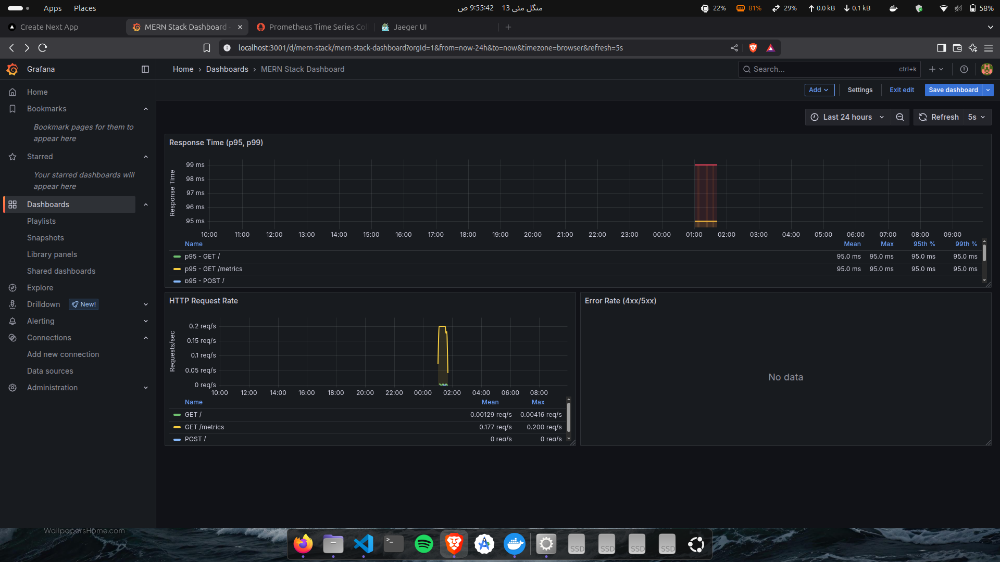

# OpenTelemetry Setup Guide

This document explains how OpenTelemetry is set up in our MERN stack application for distributed tracing and monitoring.

## Architecture Overview

Our application uses the following components:
- OpenTelemetry Collector (for receiving and processing traces)
- Jaeger (for trace visualization and analysis)
- Node.js OpenTelemetry SDK (for instrumenting our backend)
- Prometheus (for metrics collection)
- Grafana (for metrics visualization)


## Components

### 1. OpenTelemetry Collector
The collector acts as a central hub for receiving, processing, and exporting traces. It's configured to:
- Receive traces via gRPC (port 4317) and HTTP (port 4318)
- Process traces using batch and memory limiter processors
- Export traces to Jaeger
- Expose metrics for Prometheus (port 8888)

Configuration (`otel-collector-config.yaml`):
```yaml
receivers:
  otlp:
    protocols:
      http:
        endpoint: 0.0.0.0:4318
      grpc:
        endpoint: 0.0.0.0:4317

processors:
  batch:
    timeout: 1s
    send_batch_size: 1024
  memory_limiter:
    check_interval: 1s
    limit_mib: 1500
    spike_limit_mib: 512

exporters:
  otlp:
    endpoint: jaeger:4317
    tls:
      insecure: true
  debug:
    verbosity: detailed

service:
  pipelines:
    traces:
      receivers: [otlp]
      processors: [memory_limiter, batch]
      exporters: [otlp, debug]
```

### 2. Prometheus
Prometheus is used for metrics collection and storage. It's configured to scrape metrics from:
- OpenTelemetry Collector
- Backend service
- Prometheus itself

Configuration (`prometheus.yml`):
```yaml
global:
  scrape_interval: 15s
  evaluation_interval: 15s

scrape_configs:
  - job_name: 'otel-collector'
    static_configs:
      - targets: ['otel-collector:8888']

  - job_name: 'backend'
    static_configs:
      - targets: ['backend:5001']

  - job_name: 'prometheus'
    static_configs:
      - targets: ['localhost:9090']
```

### 3. Grafana
Grafana provides visualization for metrics collected by Prometheus. Features include:
- Pre-configured Prometheus data source
- Custom dashboard for application metrics
- Real-time monitoring of:
  - HTTP request rates
  - Response times
  - Error rates
  - Resource usage

### 4. Backend Instrumentation
Our Node.js backend is instrumented using the OpenTelemetry SDK. Key features:
- Automatic instrumentation for HTTP, Express, and MongoDB
- Custom spans for API endpoints and database operations
- gRPC exporter for sending traces to the collector
- Metrics exposed for Prometheus scraping

Configuration (`backend/src/utils/telemetry.ts`):
```typescript
export function setupTelemetry() {
  const sdk = new NodeSDK({
    resource: new Resource({
      [SemanticResourceAttributes.SERVICE_NAME]: 'backend-service',
      [SemanticResourceAttributes.SERVICE_VERSION]: '1.0.0',
      [SemanticResourceAttributes.DEPLOYMENT_ENVIRONMENT]: 'development'
    }),
    traceExporter: new OTLPTraceExporter({
      url: process.env.OTEL_EXPORTER_OTLP_ENDPOINT || 'http://otel-collector:4317',
    }),
    instrumentations: [getNodeAutoInstrumentations()]
  });
}
```

### 5. Docker Compose Setup
All services are connected through a Docker network for proper communication:

```yaml
services:
  otel-collector:
    image: otel/opentelemetry-collector-contrib:latest
    ports:
      - "4317:4317"   # OTLP gRPC
      - "4318:4318"   # OTLP HTTP
      - "8888:8888"   # Prometheus metrics
    networks:
      - app-network

  prometheus:
    image: prom/prometheus:latest
    ports:
      - "9090:9090"
    networks:
      - app-network

  grafana:
    image: grafana/grafana:latest
    ports:
      - "3001:3000"
    networks:
      - app-network

  backend:
    environment:
      - OTEL_EXPORTER_OTLP_ENDPOINT=http://otel-collector:4317
    networks:
      - app-network
```

## How to Use

1. Start the services:
   ```bash
   docker-compose up --build
   ```

2. Access the monitoring tools:
   - Jaeger UI: http://localhost:16686
   - Prometheus: http://localhost:9090
   - Grafana: http://localhost:3001 (admin/admin)

3. In Grafana:
   - Log in with admin/admin
   - Navigate to Dashboards
   - Open the "Application Dashboard"
   - Configure panels to show:
     - HTTP request rates
     - Response times
     - Error rates
     - Resource usage

4. Make requests to your backend API to generate traces and metrics

### Jaeger UI



### Graphana Dashboard

## Custom Tracing

We've implemented custom tracing for:
- API endpoints (method, path, status code)
- Database operations (operation type, collection, duration)

Example of custom span creation:
```typescript
export function trackApiEndpoint(method: string, path: string, status: number) {
  const span = tracer.startSpan('api-endpoint');
  span.setAttributes({
    'http.method': method,
    'http.route': path,
    'http.status_code': status
  });
  if (status >= 400) {
    span.setStatus({ code: SpanStatusCode.ERROR });
  }
  span.end();
}
```

## Dependencies

Key packages used:
- OpenTelemetry:
  - `@opentelemetry/api`
  - `@opentelemetry/sdk-node`
  - `@opentelemetry/auto-instrumentations-node`
  - `@opentelemetry/exporter-trace-otlp-grpc`
  - `@opentelemetry/resources`
  - `@opentelemetry/semantic-conventions`
- Monitoring:
  - Prometheus
  - Grafana

## Troubleshooting

1. If traces aren't appearing in Jaeger:
   - Check if the backend is connected to the collector
   - Verify the collector is receiving traces
   - Ensure all services are on the same Docker network

2. If metrics aren't appearing in Grafana:
   - Check Prometheus targets (http://localhost:9090/targets)
   - Verify metrics endpoints are accessible
   - Check Grafana data source configuration

3. Common issues:
   - Network connectivity between services
   - Incorrect endpoint URLs
   - Missing environment variables
   - Version mismatches between packages


